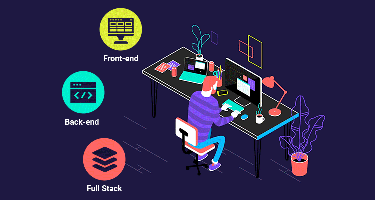

Hi, i'm <a href="https://github.com/RonaldGuilhermePDS">Ronald</a>, an IT enthusiast since I was 12 years old and with excellent skills in Building/Deconstructing "Softwares".

<h3 align="center">🛠&nbsp;Languages and Tools:&nbsp;🛠</h3>

  &nbsp;
  &nbsp;
  &nbsp;
  &nbsp;
  &nbsp;
  &nbsp;
  &nbsp;
  &nbsp;
  &nbsp;
  &nbsp;
  &nbsp;

<h3 align="center">🏆&nbsp;GitHub Trophies&nbsp;🏆</h3>

<h3 align="center">📫&nbsp;Contacts&nbsp;📫</h3>

</a><a href="#" target="_blank" rel="noopener noreferrer">

Credits: <a href="https://github.com/RonaldGuilhermePDS">RonaldGuilhermePDS</a>   Last Updated ON: 21/08/2021

 “Intelligence is the ability to adapt to change. ” ― Stephen Hawking 

